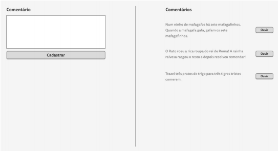

# Watson TTS [Text to Speech]

- Para rodar o projeto é necessário ter o MySql e o ambiente Node instalado. 

- O primeiro passo é rodar o comando `npm i` dentro da pasta `backend` e se desejar utilizar um servidor para o frontend execute também o `npm i` dentro da pasta `frontend` que deixei no `package.json` o `http-server`.

- Preparei um arquivo sql para fazer uma inserção prévia dos dados chamado `database.sql`, basta rodar o seguinte comando `mysql -u {user} -p --default-character-set=utf8 {dbname} < .\database.sql`.

- Algumas considerações importantes: na raiz da pasta backend é encontrado o arquivo `.env` e nele estão as variáveis de ambiente para realizar a conexão com o banco e se faz necessário prover `DB_NAME` `DB_USER` `DB_PASS`

- Para startar o backend se faz necessário rodar o comando `npm start` ou se preferir pode usar o nodemon sobre o arquivo `server.js`. Para startar o frontend basta executar o `npm start` ou abrir o arquivo.

- Se a variável de ambiente `PORT` for modificada no backend é necessário atualizar a no frontend a porta na variável `port` para requisição dentro do arquivo `Comentario.js`. 

 
